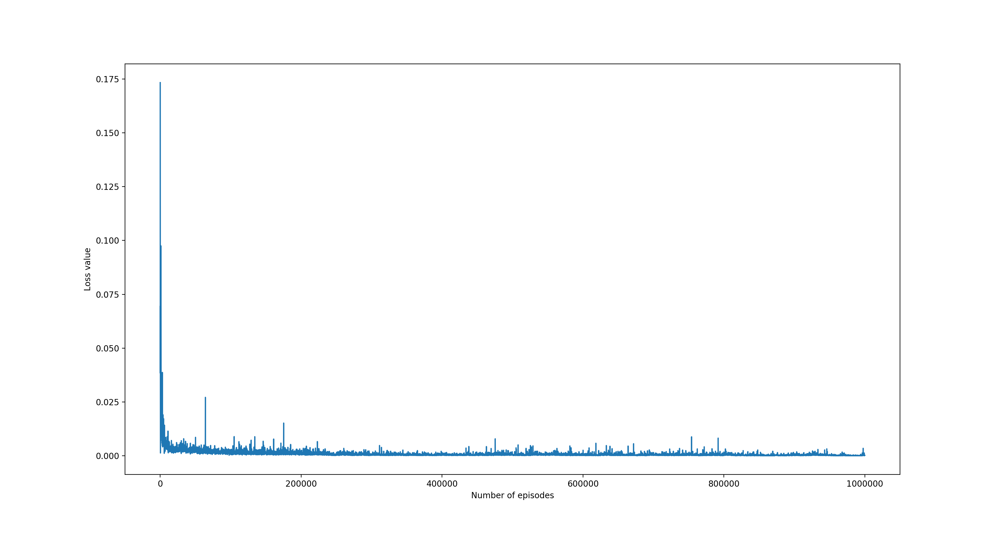
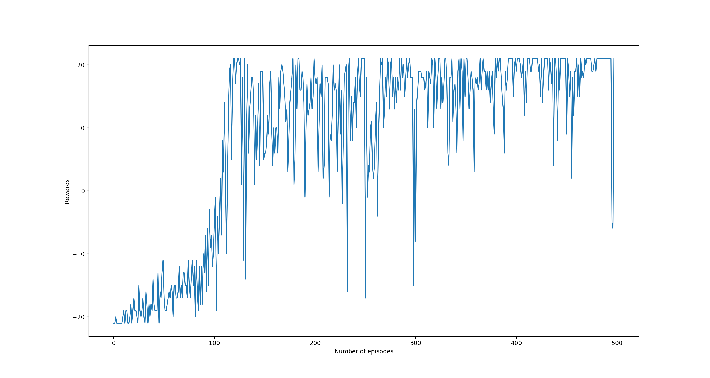

# noisynetDQN
Tensorflow implementation of noisy DQN

### This is a tensorflow implementation of the paper [Noisy Networks For Exploration](https://arxiv.org/abs/1706.10295) arXiv preprint arXiv:1706.10295 (2018) over the Open AI Atari gym environment.

To start training, simply run :-
```
python noisy_dqn.py
```
This will start the noisy DQN training for the pong atari game.

To do vanilla DQN trainining run:-(Note - epsiolon greedy exploration will not happen even for the vanilla DQN case) 
```
python noisy_dqn.py --NoisyDQN True

```

Below is the plot showing the evolution of loss and reward with training for the noisy DQN case over the pong environment.





#### Acknowledgment
Code borrowed from [RL-Adventure](https://github.com/higgsfield/RL-Adventure)
